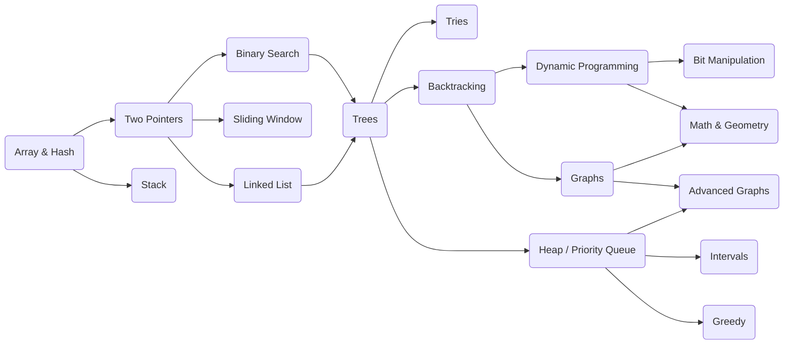

<!-- markdownlint-disable MD033 -->
# LeetCode Rust

An ongoing list of LeetCode problem solutions in Rust.

## NeetCode Roadmap

Refer to [NeetCode Roadmap](https://neetcode.io/roadmap).

<details><summary>Roadmap Mermaid Flowchart</summary>



</details>

## Get Started

Solutions for LeetCode problems are written in files under [./tests](./tests/)
respectively. This means that rust compiler can check errors and run test cases
for a specific LeetCode problem.
But for comprehensive tests, you should copy the code to LeetCode live editor
and submit. See [LeetCode problem set](https://leetcode.com/problemset/).

There are several ways to run tests:

```sh
# Run an integration test with "cargo test".
cargo test --test TEST -- --no-capture
# Run an integration test with "cargo nextest".
cargo nextest run --test TEST --no-capture
# The same as "cargo nextest" above, but more handy (recommended).
just tf TEST

# For example, run tests in "./tests/15_3sum.rs".
just tf 15_3sum
```

It's recommended to install [just](https://github.com/casey/just)
and [nextest](https://github.com/nextest-rs/nextest),
so that you can use `just tf TEST` command to test.

## Table of Problems

### Array & Hash

| Problem | Difficulty | Solution |
| - | - | - |
| 1. Two Sum | Easy | [1_two_sum.rs](./tests/1_two_sum.rs) |
| 217. Contains Duplicate | Easy | [217_contains_duplicate.rs](./tests/217_contains_duplicate.rs) |
| 242. Valid Anagram | Easy | [242_valid_anagram.rs](./tests/242_valid_anagram.rs) |
| 49. Group Anagrams | Medium | [49_group_anagrams.rs](./tests/49_group_anagrams.rs) |
| 347. Top K Frequent Elements | Medium | [347_top_k_frequent_elements.rs](./tests/347_top_k_frequent_elements.rs) |

### Two Pointers

| Problem | Difficulty | Solution |
| - | - | - |
| 125. Valid Palindrome | Easy | [125_valid_palindrome.rs](./tests/125_valid_palindrome.rs) |
| 15. 3Sum | Medium | [15_3sum.rs](./tests/15_3sum.rs) |

### Stack

| Problem | Difficulty | Solution |
| - | - | - |
| 20. Valid Parentheses | Easy | [20_valid_parentheses.rs](./tests/20_valid_parentheses.rs) |

### Binary Search

| Problem | Difficulty | Solution |
| - | - | - |
| 704. Binary Search | Easy | [704_binary_search.rs](./tests/704_binary_search.rs) |
| 74. Search a 2D Matrix | Medium | [74_search_a_2d_matrix.rs](./tests/74_search_a_2d_matrix.rs) |

### Sliding Window

| Problem | Difficulty | Solution |
| - | - | - |
| 121. Best Time to Buy and Sell Stock | Easy | [121_best_time_to_buy_and_sell_stock.rs](./tests/121_best_time_to_buy_and_sell_stock.rs) |
| 3. Longest Substring Without Repeating Characters | Medium | [3_longest_substring_without_repeating_characters.rs](./tests/3_longest_substring_without_repeating_characters.rs) |

### Linked List

| Problem | Difficulty | Solution |
| - | - | - |
| 206. Reverse Linked List | Easy | [206_reverse_linked_list.rs](./tests/206_reverse_linked_list.rs) |
| 21. Merge Two Sorted Lists | Easy | [21_merge_two_sorted_lists.rs](./tests/21_merge_two_sorted_lists.rs) |

### Trees

| Problem | Difficulty | Solution |
| - | - | - |
| 226. Invert Binary Tree | Easy | [226_invert_binary_tree.rs](./tests/226_invert_binary_tree.rs) |
| 104. Maximum Depth of Binary Tree | Easy | [104_maximum_depth_of_binary_tree.rs](./tests/104_maximum_depth_of_binary_tree.rs) |
| 102. Binary Tree Level Order Traversal | Medium | [102_binary_tree_level_order_traversal.rs](./tests/102_binary_tree_level_order_traversal.rs) |

### Backtracking

| Problem | Difficulty | Solution |
| - | - | - |
| 78. Subsets | Medium | [78_subsets.rs](./tests/78_subsets.rs) |
| 39. Combination Sum | Medium | [39_combination_sum.rs](./tests/39_combination_sum.rs) |

### Graphs

| Problem | Difficulty | Solution |
| - | - | - |
| 200. Number of Islands | Medium | [200_number_of_islands.rs](./tests/200_number_of_islands.rs) |
| 695. Max Area of Island | Medium | [695_max_area_of_island.rs](./tests/695_max_area_of_island.rs) |

### Heap / Priority Queue

| Problem | Difficulty | Solution |
| - | - | - |
| 703. Kth Largest Element in a Stream | Easy | [703_kth_largest_element_in_a_stream.rs](./tests/703_kth_largest_element_in_a_stream.rs) |
